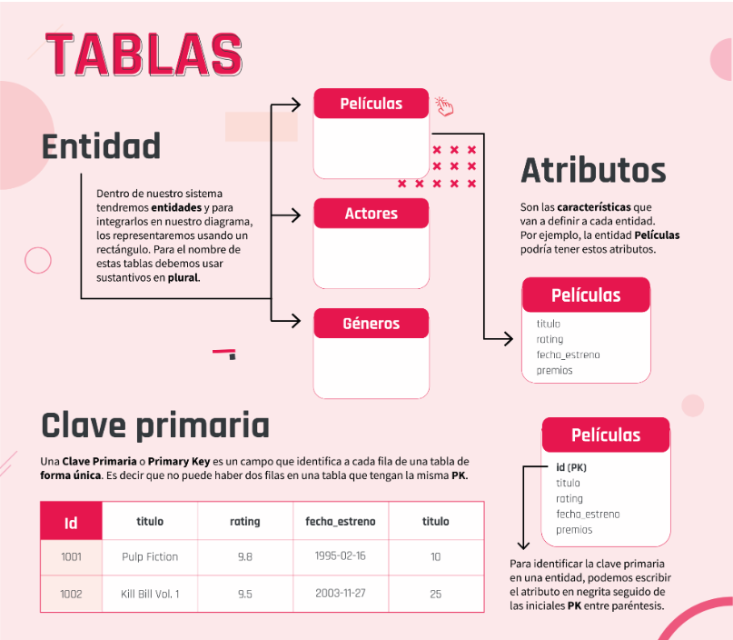
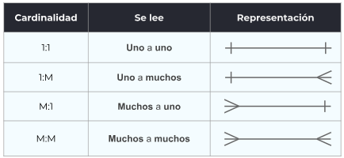
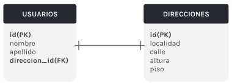
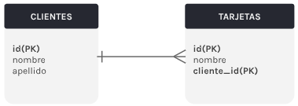
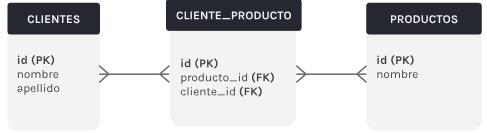
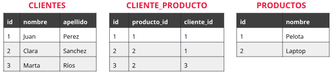
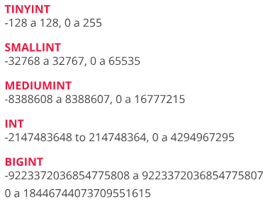
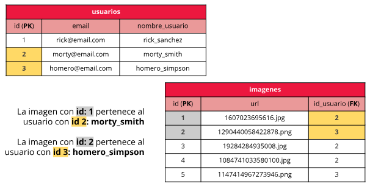

# Base de datos

## Introduccion

- Es un conjunto de datos pertenecientes a un mismo contexto organizados para un proposito especifico.
- Es una representacion de aspectos de la realidad.
- Nos sirven para:
  - Almacenar datos
  - Acceder a los datos
  - Manipular datos y combinarlos
  - Analizar datos

## Tablas

Los registros concretos se organizan dentro de tablas con filas y columnas.

Filas: contienen los datos/registros concretamente.

Columnas: representan los atributos/campos de cada dato/registro.



## Relaciones

Indican como se van a relacionar dos tablas. Dentro de una base de datos existen 3 tipos de relaciones:

- Uno a uno
- Uno a muchos
- Muchos a muchos

### Cardinalidad

Es la forma en que se relacionan las entidades



### Tipos de relaciones

#### Uno a uno (1:1)

Un usuario tiene solo una direccion. Una direccion pertenece a solo un usuario.
Para estabecer la relacion colocamos la clave primaria de la direccion en la tabla de usuarios, indicando que esa direccion esta asociada a ese usuario.



#### Uno a muchos (1:M)

Un cliente puede tener muchas tarjetas. Una tarjeta pertenece solo a un cliente. Para establecer la relacion colocamos la clave primaria del cliente en la tabla de tarjetas, indicando que esas tarjetas estan asociadas a un usuario en particular.



#### Muchos a muchos (M:M)

Un cliente puede comprar muchos productos. Un producto puede ser comprado por muchos clientes. En las relaciones M:M, en la base de datos, la relacion en si pasa a ser una tabla. Esta tabla intermedia (tabla pivot) tiene como minimo 3 datos: una clave primaria (PK) y dos claves foraneas (FK), cada una haciendo referencia a cada tabla de la relacion.



- Ejemplo:



## Tipos de datos

Los datos o atributos de cada registro de una tabla tienen que ser de un tipo de dato concreto. Cada tipo de dato tiene un tamano determinado y cuanta mas precision pongamos a este tipo de dato, mas rapido y performante va a funcionar MySQL.

### Datos de tipo numerico

- Numericos sin decimales:



- Booleanos: MySQL guarda los booleanos como un cero (false) o como un uno (true). Por cuestiones de performance, no se recomienda utilizar este tipo de dato en MySQL. Se recomienda usar el tipo de dato TINYINT.

### Datos de tipo fecha

MySql no comprueba de una manera estricta si una fecha es valida o no.

- DATE: Almacena solamente la fecha en formato YYYY-MM-DD

- TIME: Almacena solamente la hora en formato HH:MM:SS

- DATETIME: Corresponde a una representacion completa de fecha y hora. YYYY-MM-DD HH:MM:SS

### Datos de tipo texto

- CHAR(num): El numero entre parentesis va a indicar la cantidad exacta de caracteres.

- VARCHAR(num): El numero entre parentesis va a indicar la cantidad exacta de caracteres.

- TEXT: Determina un dato de tipo texto sin limite de caracteres.

## Constrains

Nos permiten generar un esquema de informacion mucho mas estable y funcional a los ojos de nuestra aplicacion.

- UNIQUE KEYS: Solo permite valores unicos para uno (o multiples) campos.
- NULL / NOT NULL: "NULL" significa que el valor para ese campo no existe o no se conoce. "NULL" no es vacio '' ni cero.
- DEFAULT: Se usa para definir un valor por defecto para una columna. Este valor se le va a agregar a cada registro nuevo siempre y cuando no se especifique otro valor que lo sobreescriba.
- AUTO_INCREMENT: Genera un numero unico y lo incrementa automaticamente con cada nuevo registro en la tabla. Se suele usar a menudo para el campo ID.

## Create, drop y alter

### Create

Con CREATE TABLE podemos crear una tabla desde cero, junto con sus columnas, sus tipos y sus constrains.

```SQL
CREATE TABLA nombre-de-la-tabla(
  nombre-columna-1 TIPO-DATO CONSTRAINT,
  nombre-columna-2 TIPO-DATO CONSTRAINT,
)
```

- foreign key:

Cuando creemos una columna que contenga una id foranea, sera necesario usar la sentencia FOREIGN KEY para aclarar a que tabla y a que columna hace referencia aquel dato. La tabla "clientes" debera existir antes de correr esta sentencia para crear la tabla "ordenes".

```SQL
CREATE TABLE ordenes(
  orden_id INT NOT NULL,
  orden_numero INT NOT NULL,
  cliente_id INT,
  PRIMARY KEY (orden_id),
  FOREIGN KEY (cliente_id) REFERENCES clientes(id)
);
```

### Drop

DROP TABLE borrara la tabla que le especifiquemos en la sentencia.

```SQL
DROP TABLE IF EXIST movies;
```

### Alter

ALTER TABLE permite alterar una tabla ya existente y va a operar con tres comandos:

- ADD: Para agregar una columna. Ejemplo, agrega la columna rating, aclarando tipo de dato y constrint.

```SQL
ALTER TABLE movies
ADD rating DECIMAL(3,1) UNSIGNED NOT NULL;
```

- MODIFY: Para modificar una columna. Ejemplo, modifica el decimal de la columna rating. Aunque el resto de las configuraciones de la tabla no se modifiquen, es necesario escribirlas en la sentencia.

```SQL
ALTER TABLE movies
MODIFY rating DECIMAL(4,1) UNSIGNED NOT NULL;
```

- DROP: Para borrar una columna. Ejemplo, borra la columna rating.

```SQL
ALTER TABLE movies
DROP rating;
```

## Foreign keys

Es un constraint que permite que una columna de una tabla guarde como valor un dato particular que referencia a otra tabla, y que sirve para relacionar estas dos tablas entre si.

Ejemplo:



# Manipulacion y consulta de datos

## Insert, update, delete

### Insert

Existen dos formas de agregar datos en una tabla:

- Insertando datos en todas las columnas
- Insertando datos en las columnas que especificamos

#### Todas las columnas

El orden en el que insertemos los valores, debera ser el mismo orden que tengan asignadas las columnas en la tabla.

```SQL
INSERT INTO table_name(c1, c2, ...)
VALUES(v1, v2, ...)
```

```SQL
INSERT INTO usuarios(id, nombre, apellido)
VALUES(DEFAULT, 'Max', 'Power');
```

```SQL
INSERT INTO usuarios
VALUES(DEFAULT, 'Max', 'Power')
```

#### Columnas especificas

Aclarar la tabla y luego escribimos el nombre de la o las columnas entre parentesis.

```SQL
INSERT INTO usuarios(nombre)
VALUES('Santi')
```

```SQL
INSERT INTO peiculas(duracion, titulo)
VALUES(112, 'Kill Bill')
```

### Update

Modificara los registros existentes de una tabla. Utilizar WHERE para agregar la condicion de cuales son las filas que queremos actualizar.

```SQL
UPDATE nombre_tabla
SET c1 = v1, c2 = v2, ...
WHERE condicion;
```

```SQL
UPDATE usuarios
SET nombre = 'Juan', apellido = 'Doe'
WHERE id = 1;
```

### Delete

Se puede borrar informacion de una tabla. Utilizar WHERE para aclarar la condicion. Si no se escribe WHERE, se borra toda la tabla.

```SQL
DELETE FROM nombre_tabla WHERE condicion;
```

```SQL
DELETE FROM usuarios WHERE usuario_id = 4;
```

## Select

Su funcionalidad es la de realizar consultas sobre una o varias columnas de una tabla. Para especificar sobre que tabla queremos realizar esa consulta usamos la palabra clave FROM seguida del nombre de la tabla.

```SQL
SELECT nombre_columna_1, nombre_columna_2, ...
FROM nombre_tabla
```

Ejemplo: Para conocer los titulos y ratings de las peliculas guardadas en la tabla peliculas.

```SQL
SELECT titulo, rating
FROM peliculas
```

## Where y order by

### Where

Condiciona y filtra las consultas SELECT que se realizan a una base de datos.

```SQL
SELECT nombre_columna_1, nombre_columna_2, ...
FROM nombre_tabla
WHERE condicion
```

#### Operadores

- Igual a =
- Mayor que >
- Mayor o igual que >=
- Menor que <
- Menor o igual que <=
- Diferente a <>
- Diferente a !=
- Es nulo IS NULL
- Entre dos valores BETWEEN
- Lista de valores IN
- Se ajusta a... LIKE

Ejemplos:

```SQL
SELECT nombre, edad
FROM usuarios
WHERE edad > 17;
```

```SQL
SELECT *
FROM movies
WHERE title LIKE 'Avatar';
```

```SQL
SELECT *
FROM movies
WHERE awards >= 3 AND awards < 8;
```

```SQL
SELECT *
FROM movies
WHERE awards = 2 OR awards = 6;
```

### Order by

Se utiliza para ordenar los resultados de una consulta segun el valor de la columna especificada. Por defecto se ordena de forma ascendente (ASC). Para ordenarlo de forma descendiente (DESC) hay que aclararlo en la consulta.

```SQL
SELECT columna_1, columna_2, ...
FROM tabla
WHERE condicion
ORDER BY columna_1
```

```SQL
SELECT nombre, edad
FROM usuarios
WHERE edad > 21
ORDER BY nombre DESC
```

## Between y like

### Between

Se utiliza cuando necesitamos obtener valores dentro de un rango.

- Incluye los extremos
- Funciona con numeros, textos y fechas
- Se usa como un filtro de un WHERE

Ejemplo:

```SQL
SELECT nombre, edad
FROM alumnos
WHERE edad BETWEEN 6 AND 12
```

### Like

Cuando hacemos un filtro con un WHERE, podemos especificar un patron de busqueda que nos permita especificar algo en concreto que queremos encontrar en los registros. Eso lo logramos utilizando comodines (wildcards).

- Comodin %: Es un sustituto que representa cero, uno, o varios caracteres.
- Comodin \_: Es un sustituto para un solo caracter.

Ejemplos:

Devuelve aquellos nombres que tengan la letra 'a' como segundo caracter.

```SQL
SELECT nombre
FROM usuarios
WHERE edad LIKE '_a%'
```

Devuelve las direcciones de los usuarios que incluyan la calle 'Monroe'.

```SQL
SELECT nombre
FROM usuarios
WHERE direccion LIKE 'Monroe'
```

Devuelve los clientes que empiecen con 'Los' y terminen con 's'.

```SQL
SELECT nombre
FROM clientes
WHERE nombre LIKE 'Los%s'
```

## Limit y offset

### Limit

Su funcionalidad es la de limitar el numero de fila devueltas en las consultas SELECT. Tambien establece el numero maximo de registros a eliminar con DELETE.

```SQL
SELECT columna_1, columna_2, ...
FROM tabla
LIMIT cantidad_de_registros
```

### Offset

Nos permite especificar a partir de que fila comenzat en la recuperacion de los datos solicitados.

Ejemplo:

Con el OFFSET 20 desplazamos los resultados 20 posiciones para que se muestre desde la posicion 21.

```SQL
SELECT id, nombre, apellido
FROM alumnos
LIMIT 20
OFFSET 20
```

## Alias

Se usan para darle un nombre temporal a las tablas, columnas y funciones. Se definen durante una consulta y persisten solo durante esa consulta. No modifican los nombres originales en la base de datos.

```SQL
SELECT columna_1 AS alias_columna_1
FROM tabla
```

- Alias para una columna

```SQL
SELECT razon_social_cliente AS nombre
FROM cliente
```

- Alias para una tabla

```SQL
SELECT nombre, apellido, edad
FROM alumnos_comision_inicial AS alumnos
```

## Funciones de alteracion

### Concat

Se usa para concatenar dos o mas expresiones.

Ejemplo: 'Nombre: Emilia Clerke'

```SQL
SELECT CONCAT('Nombre: ', fisrt_name, ' ', last_name)
FROM actors
```

### Coalesce

Se usa para obtener la primera expresion que no sea NULL.

Ejemplo 1

```SQL
SELECT COALESCE(NULL, 1, 20, 'Digital house')
```

Ejemplo: Digital house

```SQL
SELECT COALESCE(NULL, NULL, 'Digital house')
```

### Datediff

Se usa para devolver la diferencia (en dias) entre dos fechas.

Ejemplo: devuelve 19

```SQL
SELECT DATEDIFF('2017/08/25', '2017/08/15')
```

### Extract

Se usa para extraer partes de una fecha.

SECOND, MINUTE, HOUR, DAY, WEEK, MONTH, QUARTER, YEAR.

Ejemplo: devuelve 21

```SQL
SELECT EXTRACT(SECOND FROM '2014-02-13 08:44:21')
```

### Replace

Se usa para reemplazar una secuencia de caracteres por otra en un string.

Ejemplo: Bbc Bbc

```SQL
SELECT REPLACE('abc abc', 'a', 'B')
```

### Date format

Se usa para que dada una fecha determinada se pueda formatear la misma segun deseemos.

Ejemplo: 'Thursday June 15 2017'

```SQL
SELECT DATE_FORMAT('2017-06-15', '%W %M %e %Y')
```

### Case

Se usa para evaluar condiciones y devolver la primera que se cumpla.

Ejemplo: La tabla resultante tendra 4 columnas: id, title, rating y rating_categories. Esta mostrara 'Mala', 'Regular', etc., segun el rating de la pelicula.

```SQL
SELECT
  CASE
    WHEN rating < 4 THEN 'Mala'
    WHEN rating < 6 THEN 'Regular'
    WHEN rating < 8 THEN 'Buena'
    WHEN rating < 9.5 THEN 'Muy buena'
    ELSE 'Excelente'
  END AS rating_categories
FROM movies
ORDER BY rating
```
